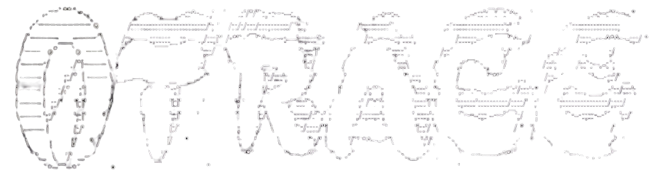

<div align="center">
  
</div>

<h1 align="center">0TRACE // TERMINAL SUITE</h1>

<p align="center">
  A premium, interactive retro-terminal interface for threat intelligence and OSINT analysis tools. Built with React and Vanilla CSS.
</p>

## ⚡ Features
- **Authentic Terminal UX**: Type commands like `ls`, `pwd`, `whoami`, `date`, and `clear`.
- **Premium Aesthetics**: High-fidelity CRT monitor simulation with scanlines, screen flicker, and glowing typography.
- **Suite Integrations**: Quickly launch connected analysis engines directly from the command line interface.

## 🛠️ Integrated Tools
| Tool | Status | Description |
| :--- | :--- | :--- |
| **VOIDTRACE** | 🟢 Online | High-Velocity IP Intelligence & Reputation suite |
| **WEBTRACE** | 🟢 Online | Domain analysis & OSINT intelligence suite |
| **PHISHX** | 🟢 Online | URL scanner & phishing detection engine |
| **DNSMAP** | 🔴 Offline | DNS recon & zone enumeration tool |
| **PORTWATCH**| 🔴 Offline | Port scanner & service fingerprinting |
| **CERTSPY** | 🔴 Offline | Cert intel & TLS certificate analyzer |
| **DARKPING** | 🔴 Offline | Threat feed & IOC correlation engine |

## 🚀 Quick Start
0trace uses a modern web stack (React + Vite) and is extremely lightweight.

```bash
# Install dependencies
npm install

# Start the local development server
npm run dev

# Build for production
npm run build
```

> **Note**: Designed for native, 0-config deployments directly to Vercel.
